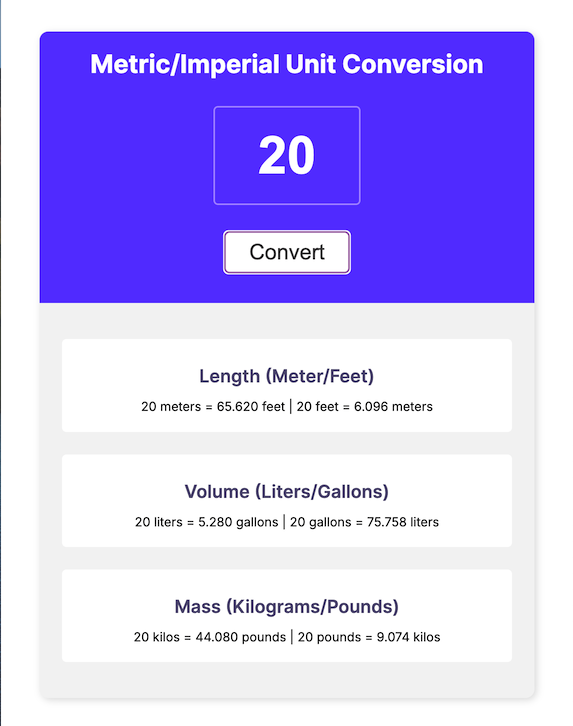

# MetricImperialConverter: Scrimba Solo Project Overview 
Goal is to convert number entered into the input field into Length, Volume, and Mass.

## About Scrimba

At Scrimba our goal is to create the best possible coding school at the cost of a gym membership! 💜
If we succeed with this, it will give anyone who wants to become a software developer a realistic shot at succeeding, regardless of where they live and the size of their wallets 🎉
The Frontend Developer Career Path aims to teach you everything you need to become a Junior Developer, or you could take a deep-dive with one of our advanced courses 🚀

- [Our courses](https://scrimba.com/allcourses)
- [The Frontend Career Path](https://scrimba.com/learn/frontend)
- [Become a Scrimba Pro member](https://scrimba.com/pricing)

Happy Coding!

### The challenge

Users should be able to:

- convert number from input into the Length, Volume, and Mass
- display those conversions in the cards below to the 3rd decimal place

### Screenshot

### Built with

- HTML5
- CSS
- Flexbox
- Javascript

